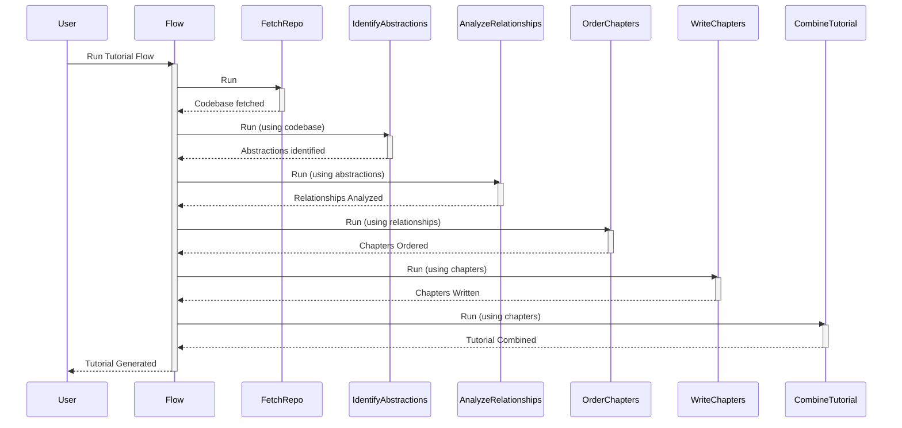

# Chapter 1: Flow

Welcome! This tutorial guides you through building a system to automatically generate tutorials, just like this one! We'll start with the very core: understanding how to organize the different steps required.

Imagine you want to create a tutorial about a piece of code, similar to this one! The process involves several stages: fetching the code, understanding it, organizing the information, and writing the tutorial. This is where the "Flow" abstraction comes in. Think of it as a director for this tutorial-generating play.

## What is a Flow?

The `Flow` is the central orchestrator. It defines the *order* in which things happen in our tutorial generation process. It's like a recipe: it specifies the steps (ingredients) and the sequence (how to mix them). This means the `Flow` takes care of the logic:

1.  **Fetch the Code:** Get the codebase to learn about.
2.  **Understand the Code:** Identify its key parts (abstractions).
3.  **Analyze Relationships:** Figure out how the parts connect.
4.  **Organize Chapters:** Determine the structure of the tutorial.
5.  **Write Chapters:** Generate the content for each chapter.
6.  **Combine Tutorial:** Put all chapters together into a final tutorial.

Without a `Flow`, we would have to manage all these steps manually, making it easy to get lost.

Let's dive in!

### Key Concepts:

*   **Nodes:** These are individual "actors" or "workers" in our play. Each node performs a specific task, like fetching the code or writing a chapter. We will learn more about nodes in [Chapter 3: Node](03_node_.md) and [Chapter 4: BatchNode](04_batchnode_.md).
*   **Connections:** Nodes are linked together to create the flow's sequence. The output of one node becomes the input of the next.

## Using the Flow to Generate a Tutorial

Now, let's see how we define this flow in code:

```python
from pocketflow import Flow
from nodes import (  # Nodes are imported to use.
    FetchRepo,
    IdentifyAbstractions,
    AnalyzeRelationships,
    OrderChapters,
    WriteChapters,
    CombineTutorial
)

def create_tutorial_flow():
    # Instantiate Nodes
    fetch_repo = FetchRepo()
    identify_abstractions = IdentifyAbstractions()
    analyze_relationships = AnalyzeRelationships()
    order_chapters = OrderChapters()
    write_chapters = WriteChapters()
    combine_tutorial = CombineTutorial()

    # Connect Nodes
    fetch_repo >> identify_abstractions
    identify_abstractions >> analyze_relationships
    analyze_relationships >> order_chapters
    order_chapters >> write_chapters
    write_chapters >> combine_tutorial

    # Create the flow and specify the start node.
    tutorial_flow = Flow(start=fetch_repo)
    return tutorial_flow
```

Let's break this down:

1.  **Import necessary tools.** We bring in `Flow` from `pocketflow` and all the node classes from `nodes.py`. The `nodes` module contains the implementation details.
2.  **Instantiate Nodes:** We create instances of each node that performs a single action, like `FetchRepo`. (we will talk about the implementation in [Chapter 3: Node](03_node_.md))
3.  **Connect the nodes.** We use `>>` to connect nodes, determining the order of execution. For example, `fetch_repo >> identify_abstractions` means that after `fetch_repo` completes, `identify_abstractions` starts.
4.  **Create the `Flow`:** We tell the `Flow` where to begin. The `start=fetch_repo` argument specifies that the `FetchRepo` node is the first to be executed.

### Execution Walkthrough

When we *run* this flow (which we'll see in a later chapter!), the `Flow` object takes control. Here's a simplified sequence of what happens, like a play's stage directions:



1.  The `Flow` starts the `FetchRepo` node.
2.  `FetchRepo` gets the codebase.
3.  `Flow` starts `IdentifyAbstractions` using the fetched codebase.
4.  ... and so on, with each node passing its output to the next.
5.  Finally, `CombineTutorial` creates the final tutorial.

## Under the Hood: How `Flow` Works

Let's get a peek behind the curtain, without going into the exact code.  The `Flow` object internally has a few key responsibilities:

*   **Tracking Nodes:**  It keeps a record of all the nodes it's managing.
*   **Managing Dependencies:**  It knows which node depends on which (because of the `>>` connections).
*   **Executing Nodes in Order:**  It runs the nodes one at a time, ensuring that the output of one node is passed as input to the next.

In simple terms, it's just a clever way to run the parts of your system in the right sequence!

The actual `Flow` implementation is in `flow.py`.

## Conclusion

We've learned that a `Flow` helps us organize complex processes by defining the sequence of actions. By using a `Flow`, we can structure our tutorial generation process in a clear and maintainable way, setting the stage for more advanced functionality in the next chapters.

Now that we understand how the overall process is structured using `Flow`, let's dive deeper and learn how to fetch the source code, starting with [Chapter 2: File Crawling](02_file_crawling_.md).


---

Generated by [AI Codebase Knowledge Builder](https://github.com/The-Pocket/Tutorial-Codebase-Knowledge)