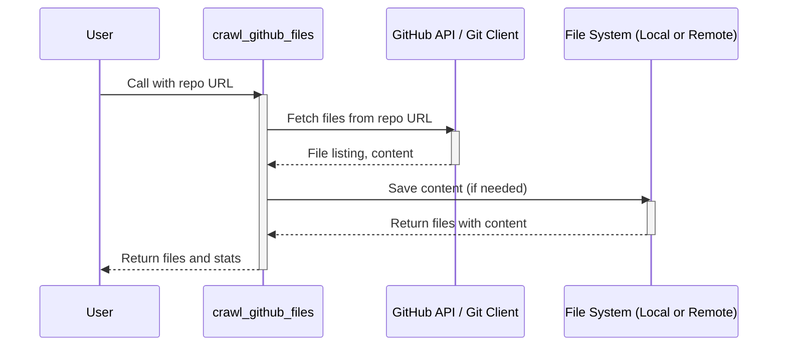

# Chapter 2: File Crawling

In the previous chapter, [Chapter 1: Flow](01_flow_.md), we learned how to orchestrate the process of generating a tutorial using the `Flow` abstraction. Now, we need to get the code we want to write a tutorial about! This is where "File Crawling" comes in.

Imagine you want to write a tutorial about a specific function in a GitHub repository. To do this, you first need to *find* that function's code file. File crawling helps us do that! It's like having a digital librarian that can explore a code repository or folder and gather all the code files for us.

## What is File Crawling?

File Crawling is the process of automatically finding and collecting code files from a specific location, like a folder on your computer or a GitHub repository. Think of it as the librarian gathering all the books (code files) from a library (repository/directory) and organizing them to be used later.

## Key Concepts:

*   **Directory/Repository:** The starting point for the search. This is where the librarian begins looking for files. It can be a local folder, or a remote git repository.
*   **File Path:** The location of a file within the directory/repository. This helps us know where each file is located.
*   **File Content:** The actual code inside the file. This is the information we want to analyze to generate our tutorial.
*   **Include/Exclude Patterns:**  These are like filters. We can specify which files to *include* (e.g., only Python files) and which to *exclude* (e.g., test files or files above a certain size). This allows us to focus on the relevant code.

## Using File Crawling

Let's say we want to write a tutorial about the `crawl_github_files` function itself (the one we will use). This function is located in `utils/crawl_github_files.py` of the current codebase repository.

First, we need to *crawl* the codebase to retrieve its content.

Here's how we might use file crawling:

```python
from utils.crawl_github_files import crawl_github_files

repo_url = "https://github.com/PocketFlow-Tutorial-Codebase-Knowledge/PocketFlow-Tutorial-Codebase-Knowledge/tree/main"  # URL of the repository
files_data = crawl_github_files(repo_url)

if files_data and files_data["files"]:
    for file_path, content in files_data["files"].items():
        print(f"File: {file_path}")
        print(f"Content (first 50 characters): {content[:50]}...\n")
else:
    print("No files found or an error occurred.")
```

Let's break this code down:

1.  **Import `crawl_github_files`:**  We import the function from the `utils` folder (we will explore the implementation later).
2.  **Specify the repository URL:** We provide the URL of the GitHub repository we want to explore.
3.  **Call `crawl_github_files`:**  We call the function, passing the repository URL.  This function will automatically fetch all the files from that repository.
4.  **Iterate and print:** We loop through the files found. For each file, we print the file path and a preview of its content.
5.  **Error handling:** Check if any file found or an error occurred.

This code will print the file paths and a snippet of the content of all the files in the specified GitHub repository.

For example, the output should include:

```
File: .github/ISSUE_TEMPLATE/bug_report.yml
Content (first 50 characters): name: Bug Report
description: Report a reproducibl...
```

and

```
File: utils/crawl_github_files.py
Content (first 50 characters): import requests
import base64
import os
import tempfile
```

## Under the Hood: How `crawl_github_files` Works

Let's see what happens when we call `crawl_github_files`.



Here's a simplified explanation:

1.  The user calls `crawl_github_files`.
2.  `crawl_github_files` uses the GitHub API (or Git client) to fetch files from the specified repository (or reads from local file system if directory).
3.  The function returns the file paths and their contents.

## Implementing `crawl_github_files` (Simplified)

The actual implementation is slightly more complex. Here is a simplified version. The real code is located in `utils/crawl_github_files.py` and `utils/crawl_local_files.py`

```python
# utils/crawl_github_files.py (simplified)
import requests
import os

def crawl_github_files(repo_url, token=None):
    # 1. Parse the URL
    # 2.  Use the Github API to find the files and their content
    #   ... (API calls and error handling) ...
    owner = "PocketFlow-Tutorial-Codebase-Knowledge"
    repo = "PocketFlow-Tutorial-Codebase-Knowledge"
    headers = {"Accept": "application/vnd.github.v3+json"}
    if token:
        headers["Authorization"] = f"token {token}"
    url = f"https://api.github.com/repos/{owner}/{repo}/contents/"
    response = requests.get(url, headers=headers)
    if response.status_code != 200:
        return {"files": {}, "stats": {"error": f"Error: {response.status_code}"}}

    files = {}
    for item in response.json():
        if item["type"] == "file":
            file_url = item["download_url"]
            file_response = requests.get(file_url, headers=headers)
            if file_response.status_code == 200:
                files[item["path"]] = file_response.text
    return {"files": files, "stats": {}}
```

1.  **Parse the URL**: Extract useful information from the URL.
2.  **Make API Requests**:  This code uses the Github API to fetch file listings and content, then returns these.
3.  **Error handling**: Handles potential errors.

## Implementing `crawl_local_files` (Simplified)

For crawling local files, you can directly use `os.walk`.

```python
# utils/crawl_local_files.py (simplified)
import os

def crawl_local_files(directory, include_patterns=None, exclude_patterns=None):
    files = {}
    for root, _, filenames in os.walk(directory):
        for filename in filenames:
            file_path = os.path.join(root, filename)
            try:
                with open(file_path, "r", encoding="utf-8") as f:
                    content = f.read()
                # Apply include and exclude patterns if specified
                if include_patterns and not any(pattern in file_path for pattern in include_patterns):
                    continue  # Skip if not in include patterns
                if exclude_patterns and any(pattern in file_path for pattern in exclude_patterns):
                    continue  # Skip if in exclude patterns
                files[file_path] = content
            except Exception as e:
                print(f"Error reading {file_path}: {e}")
    return {"files": files}
```

Here's a simplified explanation:

1.  **Iterate through the directory:** `os.walk` goes through each file in the directory.
2.  **Read file content**: Opens and reads each file.
3.  **Apply include and exclude patterns**: Filter files by include/exclude patterns
4.  **Return the results**: Returns the list of files and contents

## Conclusion

In this chapter, we learned about "File Crawling" and how it helps us gather the code files we need for our tutorial. We saw how to use `crawl_github_files` and `crawl_local_files` to explore a repository or directory, and we looked at a simplified version of how they're implemented. Now that we know how to fetch the code, in the next chapter, we'll learn about [Chapter 3: Node](03_node_.md), which will help us organize the steps in the tutorial generation process!


---

Generated by [AI Codebase Knowledge Builder](https://github.com/The-Pocket/Tutorial-Codebase-Knowledge)