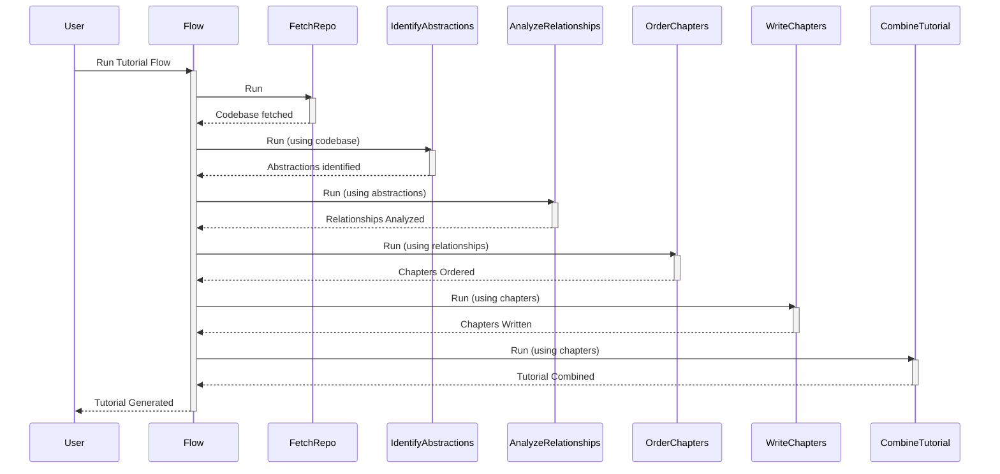

# Chapter 3: Node

In the previous chapter, [Chapter 2: File Crawling](02_file_crawling_.md), we learned how to fetch files from a repository or local directory. Now that we have the files, we need a way to organize the different steps in the tutorial generation process. This is where the "Node" concept comes in.

Imagine you're building a house. You have different workers: a carpenter (who builds the frame), an electrician (who wires the house), and a plumber (who installs the pipes). Each worker performs a specific task. "Nodes" are similar, they are the individual actors in our tutorial generation play, each designed to perform a specific task.

## What is a Node?

A "Node" is a building block of our tutorial generation system. Think of it as a single, self-contained unit that performs a specific action. For example, there could be a `FetchRepo` node (as we saw in [Chapter 1: Flow](01_flow_.md)) to download the code, an `IdentifyAbstractions` node to understand the code, or a `WriteChapters` node to write the tutorial content.

Each node takes an input, does something with it (its "task"), and then produces an output. Think of it like a factory: raw materials (input) go in, the factory does its work (task), and finished products (output) come out.

## Key Concepts:

*   **Input:** What the node needs to start its work. This could be the code files, a list of abstractions, or anything else.
*   **Task:** What the node *does*. This is the core logic of the node.
*   **Output:** The result of the node's task. This output is then passed to the next node in the process.

## How Nodes Work in Our Tutorial System

Let's look at how a `Node` works in the context of our overall tutorial generation process, revisiting the `Flow` structure from [Chapter 1: Flow](01_flow_.md):



1.  **`FetchRepo`**: This node's input is the URL of a GitHub repository (or a local directory), and its task is to fetch all the files. The output is a list of files and their content.
2.  **`IdentifyAbstractions`**: This node's input is the list of files from `FetchRepo`. The task is to analyze the code and identify the key abstractions. The output is a list of identified abstractions (names, descriptions).
3.  **`AnalyzeRelationships`**: This node takes as input the abstractions list from `IdentifyAbstractions` and determines the relationships between them. The output describes those relationships.
4.  **`OrderChapters`**: This node's input is the relationships, and its task is to determine the best order for explaining the abstractions in the tutorial. The output is the order in which the chapters should be written.
5.  **`WriteChapters`**: This node's input is the chapter order, abstractions, and relationships. It uses this to generate the Markdown content for each chapter. The output is a list of generated chapter contents.
6.  **`CombineTutorial`**: This node's input is all the generated chapter contents and the other information like project name. It combines all of these into a final tutorial and saves it.

## Under the Hood: The Anatomy of a Node

Let's look at a simplified example of how a node might be implemented in Python:

```python
from pocketflow import Node

class GreetNode(Node):
    def prep(self, shared):
        # (Optional) Prepare data before execution
        self.name = shared.get("name", "World")  # Get name from shared
        return {} # Nothing to pass for this example

    def exec(self, prep_res):
        # (Mandatory) Perform the task
        greeting = f"Hello, {self.name}!"
        print(greeting)
        return greeting  # Output of the node

    def post(self, shared, prep_res, exec_res):
        # (Optional) Store results or modify the shared context
        shared["greeting"] = exec_res  # Store the greeting in shared
```

Let's break down each part:

1.  **`class GreetNode(Node)`:** We create a class named `GreetNode` that *inherits* from the `Node` class from the `pocketflow` library. This means our `GreetNode` automatically has some built-in Node functionalities.
2.  **`prep(self, shared)`:** The `prep` method is called before the node's execution. Here, we prepare data. The `shared` dictionary is a place to share variables across different nodes. In this example, we grab a `name` from shared, defaulting to "World" if not provided. It returns an empty dictionary, which is optional.
3.  **`exec(self, prep_res)`:** This is where the core work of the node happens. It takes any prep results as an input, but in this example it is ignored. Our `GreetNode` creates a greeting and prints it to the console. Finally, it returns the `greeting` string, which becomes the output of the node.
4.  **`post(self, shared, prep_res, exec_res)`:** The `post` method is executed after the node has finished running. It lets us store the result of the `exec` method in the shared context. We're storing the greeting in the `shared` dictionary so other nodes can use it.

In this simplified example:

*   **Input:** The `name` (optionally) passed through `shared`.
*   **Task:** Creating a greeting.
*   **Output:** The `greeting` string.

## Applying it to Tutorial Generation

Let's see how we can use the `GreetNode` as part of a simple `Flow`:

```python
from pocketflow import Flow
from nodes import GreetNode # Assuming GreetNode is in nodes.py

def create_greeting_flow(name="PocketFlow User"):
    greet_node = GreetNode()
    # Provide the name in shared
    tutorial_flow = Flow(start=greet_node, shared={"name": name})
    return tutorial_flow
```

When we run this flow (which we'll do in a later chapter), the following happens:

1.  The `Flow` starts the `GreetNode`.
2.  The `GreetNode`'s `prep` method runs and retrieves name "PocketFlow User".
3.  The `GreetNode`'s `exec` method runs, creating the greeting "Hello, PocketFlow User!".
4.  The `GreetNode`'s `post` method stores the greeting in shared.

## Conclusion

Nodes are the individual "actors" or "workers" that perform the specific tasks in our tutorial generation system. They take input, perform their designated tasks, and produce an output that's passed on to the next node. This modular approach, using `Node`s, allows us to break down a complex process into manageable, reusable components.

In the next chapter, [Chapter 4: BatchNode](04_batchnode_.md), we will learn about `BatchNode`, a special type of Node designed to process a collection of items, perfect for handling multiple files or abstractions.


---

Generated by [AI Codebase Knowledge Builder](https://github.com/The-Pocket/Tutorial-Codebase-Knowledge)