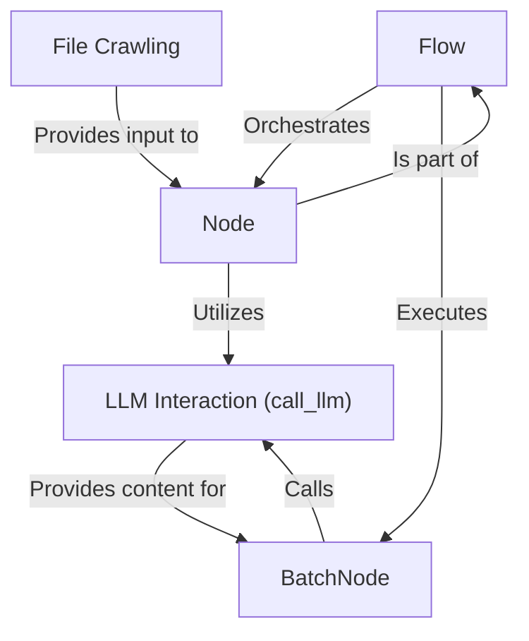

# Tutorial: PocketFlow-Tutorial-Codebase-Knowledge

This project, PocketFlow-Tutorial-Codebase-Knowledge, leverages the power of *large language models (LLMs)* to automatically generate beginner-friendly tutorials for codebases. It crawls the code, identifies key *abstractions*, analyzes their relationships, orders them logically, and then uses the LLM to write each chapter in Markdown. The final output is a complete tutorial.

**Source Repository:** [https://github.com/The-Pocket/PocketFlow-Tutorial-Codebase-Knowledge.git](https://github.com/The-Pocket/PocketFlow-Tutorial-Codebase-Knowledge.git)

## Chapters

1. [Flow
](01_flow_.md)
2. [File Crawling
](02_file_crawling_.md)
3. [Node
](03_node_.md)
4. [BatchNode
](04_batchnode_.md)
5. [LLM Interaction (call_llm)
](05_llm_interaction__call_llm__.md)

---

Generated by [AI Codebase Knowledge Builder](https://github.com/The-Pocket/Tutorial-Codebase-Knowledge)
